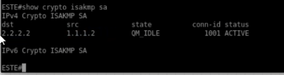
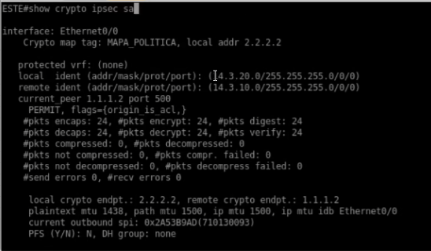
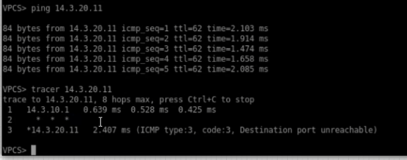

<h1>Instituto Tecnológico de Las Américas (ITLA)</h1>
  
<h2>Configuración y Verificación de VPN Site-to-Site Basada en Políticas (IPSec IKEv1)</h2>

Documentación Técnica Profesional — Práctica 5 (Semana 6)

   

<strong>Estudiante:</strong> Alan Daniel Garcia Mendez 
<strong>Matrícula:</strong> 2025-1403 
<strong>Carrera:</strong> Seguridad Informática 
<strong>Asignatura:</strong> Seguridad de Redes 
<strong>Docente:</strong> Jonathan Esteban Rondon Corniel 
<strong>Fecha de Entrega:</strong> 2 de julio de 2026 
<strong>Video de Exposición:</strong> <a href="https://youtu.be/iM46MCMfAcs">https://youtu.be/iM46MCMfAcs</a>

## Objetivo de la VPN
Establecer un túnel seguro Site-to-Site (sitio a sitio) punto a punto basado en políticas utilizando el protocolo IPSec coordinado bajo IKEv1. Este diseño interconecta las redes de área local (LAN) de dos sedes corporativas (Oeste y Este) a través de un enrutador ISP intermedio. El enfoque "basado en políticas" (Policy-based) define qué tráfico debe protegerse e introducirse en el túnel de cifrado mediante listas de control de acceso (ACL) que especifican las direcciones IP de origen y destino ("tráfico interesante").

## Topología de Red y Direccionamiento
La topología física del laboratorio en GNS3 está conformada por un enrutador ISP y dos enrutadores de sucursales denominados OESTE y ESTE. Detrás de cada router de sucursal se encuentra una red LAN y un cliente VPC de prueba.

  
  
Topología física Site-to-Site para las conexiones IPSec

El direccionamiento IP configurado para este escenario se detalla a continuación:

| Dispositivo / Rol | Interfaz o Recurso | Dirección IP / Subred | Descripción |
| :--- | :--- | :--- | :--- |
| **Router OESTE (Peer 1)** | Ethernet0/0 | `1.1.1.2/30` | WAN física hacia ISP |
| | Ethernet0/1 | `14.3.10.1/24` | LAN interna corporativa |
| | Rango Pool DHCP | `14.3.10.0/24` | Pool para clientes locales |
| **Router ESTE (Peer 2)** | Ethernet0/0 | `2.2.2.2/30` | WAN física hacia ISP |
| | Ethernet0/1 | `14.3.20.1/24` | LAN interna corporativa |
| | Rango Pool DHCP | `14.3.20.0/24` | Pool para clientes locales |
| **Router ISP (Tránsito)** | Ethernet0/0 | `1.1.1.1/30` | Conexión hacia R-Oeste |
| | Ethernet0/1 | `2.2.2.1/30` | Conexión hacia R-Este |

## Parámetros Criptográficos Utilizados
La negociación ISAKMP (Fase 1) e IPSec (Fase 2) se realiza bajo los siguientes parámetros definidos en los scripts de configuración:

| Fase | Parámetro | Valor Configurado |
| :--- | :--- | :--- |
| **Fase 1 (ISAKMP)** | Versión IKE | IKEv1 |
| **Fase 1** | Algoritmo de Cifrado | AES-256 |
| **Fase 1** | Función Hash | SHA-256 |
| **Fase 1** | Método de Autenticación | Pre-share (Clave: `CISCO123`) |
| **Fase 1** | Grupo Diffie-Hellman | Group 14 (2048-bit) |
| **Fase 1** | Tiempo de Vida (SA) | 86,400 segundos (24 horas) |
| **Fase 2 (IPSec)** | Transform-Set | `TS_IKEV1` (`esp-aes 256 esp-sha256-hmac`) |
| **Fase 2** | Modo de Operación | Tunnel Mode (`mode tunnel`) |
| **Fase 2** | Tráfico Interesante | ACL 100 (LAN-Oeste ↔ LAN-Este) |

## Explicación de la Configuración y Scripts
El enrutador OESTE y el enrutador ESTE definen listas de acceso número 100 para interceptar cualquier tráfico entre las dos subredes de confianza. Al aplicar el comando `crypto map` en sus interfaces WAN físicas externas (Ethernet0/0), el router redirige los paquetes coincidentes con la ACL para ser encapsulados por IPSec en un túnel cifrado hacia el peer opuesto.

Los archivos de configuración aplicados están documentados en la carpeta de recursos de la sucursal: [script_configuracion.txt](resources/script_configuracion.txt).

## Verificación de Funcionamiento

### 1. Estado de la Negociación ISAKMP SA (Fase 1)
Para comprobar que la negociación de la Fase 1 del protocolo ISAKMP ha finalizado con éxito, se ejecuta el comando `show crypto isakmp sa` en el router `ESTE`. La salida de consola demuestra la presencia de una SA activa establecida hacia el peer remoto `1.1.1.2` (WAN del router Oeste) utilizando el direccionamiento local `2.2.2.2`. 

La SA está en el estado **`QM_IDLE`** (Quick Mode Idle) con estado **`ACTIVE`**, lo cual confirma que el canal de control seguro bidireccional está levantado y listo.

  
  
Estado ISAKMP SA en el router ESTE confirmando la conexión IKEv1 activa

### 2. Estado de la Asociación de Seguridad IPSec (Fase 2)
La verificación de la Fase 2 se realiza mediante el comando `show crypto ipsec sa` en el router `ESTE`. La salida muestra los detalles operativos de la interfaz física `Ethernet0/0` protegida por el crypto map `MAPA_POLITICA` bajo la IP `2.2.2.2`. El tráfico interesante especifica el origen local LAN `14.3.20.0/24` y el destino LAN remoto `14.3.10.0/24`.

Los contadores de tráfico confirman el paso seguro de paquetes:
* **`#pkts encaps: 24`** y **`#pkts encrypt: 24`**
* **`#pkts decaps: 24`** y **`#pkts decrypt: 24`**

Esto indica que el router ha cifrado y transmitido 24 paquetes, y ha descifrado y recibido otros 24 paquetes de manera totalmente íntegra.

  
  
Estadísticas de la SA IPSec mostrando el cifrado y descifrado de tramas en Ethernet0/0

### 3. Prueba de Conectividad y Trazado de Ruta LAN a LAN
La validación definitiva de la VPN se realiza en el cliente VPCS ubicado en la red interna del extremo Oeste. Al ejecutar el comando `ping 14.3.20.11` hacia la IP asignada al cliente en la LAN de la sede Este, los paquetes se transmiten con éxito obteniendo **0% de pérdida**.

Además, al realizar un comando de rastreo `tracer 14.3.20.11`, se evidencia el siguiente flujo:
1. El primer salto se dirige al gateway local `14.3.10.1` (interfaz del router Oeste).
2. El segundo salto se muestra enmascarado con asteriscos (`* * *`), ya que el paquete viaja cifrado dentro del túnel IPSec y el enrutador ISP intermedio es incapaz de inspeccionar o reportar el encabezado interno del paquete IP original.
3. El tercer salto alcanza de forma transparente al host de destino `14.3.20.11`.

  
  
Prueba de ping y traceroute desde la consola de VPCS validando el enmascaramiento del túnel

